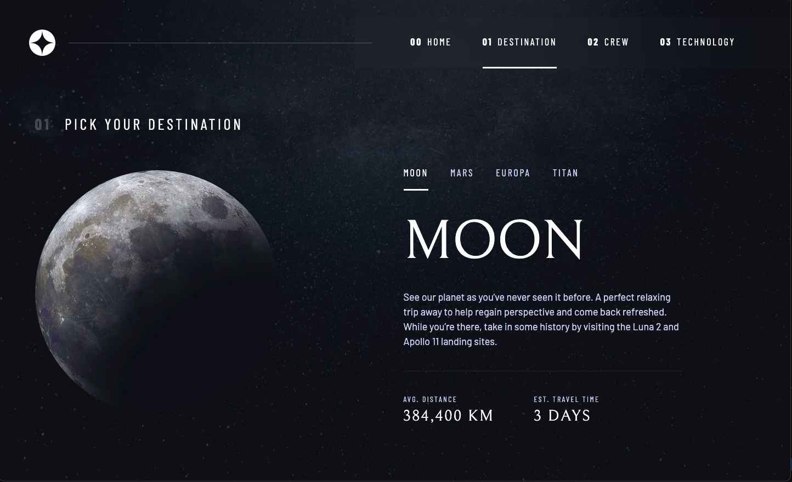

# Frontend Mentor - Space tourism website solution

This is a solution to the [Space tourism website challenge on Frontend Mentor](https://www.frontendmentor.io/challenges/space-tourism-multipage-website-gRWj1URZ3). Frontend Mentor challenges help you improve your coding skills by building realistic projects.

## Table of contents

- [Overview](#overview)
  - [The challenge](#the-challenge)
  - [Screenshot](#screenshot)
  - [Links](#links)
- [My process](#my-process)
  - [Built with](#built-with)
  - [What I learned](#what-i-learned)
  - [Continued development](#continued-development)
  - [Useful resources](#useful-resources)
- [Author](#author)
- [Acknowledgments](#acknowledgments)

## Overview

### The challenge

Users should be able to:

- View the optimal layout for each of the website's pages depending on their device's screen size
- See hover states for all interactive elements on the page
- View each page and be able to toggle between the tabs to see new information

### Screenshot



### Links

- Solution URL: [Add solution URL here](https://github.com/btebe/space-tourism)
- Live Site URL: [Add live site URL here](https://relaxed-dragon-bc5969.netlify.app/)

## My process

### Built with

- Semantic HTML5 markup
- CSS custom properties
- Flexbox
- CSS Grid
- Mobile-first workflow
- [React](https://reactjs.org/) - JS library

### What I learned

There are many topics i learnt in this project. The first is using the grid. i learnt to use the grid with its grid-template-columns and grid-template-rows and grid-template-areas. I learnt to apply them for the desktop, tablet and mobile mode. The second is that i got introduced to many css properties that i have never used before such as padding-inline, margin-block, inset, outline, aspect-ratio and many more. Thirdly, i learnt to to use the ref hook in react and applied it to make an autoplay slide. Also, i learnt that the ref hook can reference the dom element which acts like query selector.

To see how you can add code snippets, see below:

```html
<h1>Some HTML code I'm proud of</h1>
```

```css
.grid-container--tech {
  place-items: center;
  grid-template-areas:
    ". title title title"
    ". tabs content image"
    ". . . .";
  grid-template-columns: minmax(2rem, 1fr) 4rem minmax(0, 40rem);
  grid-template-rows: 20% 2fr;
  padding-left: 0;
}
```

```js
const autoPlayRef = useRef();
useEffect(() => {
  autoPlayRef.current = nextSlide;
});
```

### Continued development

I wish to apply the grid layout more efficiently by applying it to more of my projects. Also, i would like to learn more of the ref hook in react and apply it to many scenarios.

### Useful resources

- [Example resource 1](https://www.youtube.com/watch?v=lRaL-8qZ0mM&t=6404s) - This helped me create the a css utility class and handle the different layouts in the project.
- [Example resource 2](https://www.youtube.com/watch?v=t2ypzz6gJm0&list=LL&index=2&t=249s) - This helped me to simplify the ref hook.
- [Example resource 3](https://www.youtube.com/watch?v=68O6eOGAGqA&t=307s) - This helped me to learn more about the grid system.

## Author

- Website - [Basma Tebe](https://basma94tebe.wixsite.com/my-site/projects)
- Frontend Mentor - [@btebe](https://www.frontendmentor.io/profile/btebe)

## Acknowledgments

I would like to give my gratitude to Youtuber Kevin Powell for making a beginner friendly video of the solution for this project and sharing it on Youtube. I would also like to thank another Youtuber Web Dev Simplified for showing an easy to follow video explaining how a ref hook in react works.
